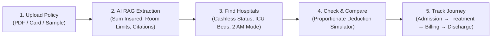

# CareWise — Smart Decisions, Better Care

> **Hackathon Prototype Submission**  
> **Author**: Lavoisie Sunny  
> **Domain**: Caregiver Healthcare Decision Support & InsurTech  

---

## 1. The Problem Statement

During medical emergencies, **caregivers — not patients — are the ones forced to make real-time decisions**, yet they have the least access to the information needed to make them. A caregiver at 2 AM typically faces four compounding problems:

1. **Hard to find eligible hospitals**: Uncertainty over which nearby hospitals accept their insurance policy or cashless TPA network.
2. **Confusing policy terms and hidden deductions**: Complex legal language makes it difficult to understand what is actually covered before admission.
3. **Co-pay and room limits leading to huge out-of-pocket expenses**: In India, breaching a room rent cap triggers a severe **proportionate deduction penalty** across surgeon fees, nursing, and OT charges, resulting in unexpected ₹75,000+ bills at discharge!
4. **Information trapped with the patient, not the caregiver**: The caregiver making urgent decisions lacks immediate access to policy documents, IDs, or TPA helpline numbers.

---

## 2. The CareWise Solution Workflow

CareWise is an AI decision-support platform that unifies insurance policy details, hospital network data, and treatment-journey tracking into a single, real-time tool built specifically for caregivers:



1. **Upload Policy**: Drag-and-drop any insurance policy PDF, or select from pre-loaded real-world policies (*Star Health Family Optima*, *HDFC ERGO Optima Secure*, *Care Health Care Advantage*).
2. **Grounded RAG Extraction**: Key coverage details extracted and grounded with exact page numbers and clause citations (Zero Hallucinations).
3. **Smart Hospital Discovery**: Real-time geo-search with specialty filters, cashless network verification, available ICU beds, and a one-click **"🚨 2 AM Emergency Mode"**.
4. **Side-by-Side Cost & Risk Comparator**: Dynamic simulator visualizing how selecting an over-limit room category triggers proportionate deduction penalties across associated doctor and surgical fees.
5. **Continuous Treatment Journey Tracker**: Follows the patient through Admission Pre-Auth, Active Treatment monitoring, interim billing discrepancy audit, and one-click Digital Claim Dossier generation.
6. **Caregiver Family SOS**: One-click WhatsApp alert generator to broadcast hospital coordinates and critical room cap instructions to family members.

---

## 3. Technology Stack & Folder Structure

Modeled after standard enterprise microservice layout:

```
CareWise/
├── backend/                  # FastAPI (Python 3.13)
│   ├── app/
│   │   ├── api/v1/           # Modular routers: health, policies, hospitals, calculator, rag, journey, sos
│   │   ├── core/             # Configuration, logging, constants
│   │   ├── schemas/          # Pydantic validation models
│   │   ├── services/         # PyMuPDF parser, RAG matcher, cost calculator, journey engine
│   │   ├── data/             # Realistic Indian health insurance & hospital network datasets
│   │   └── main.py           # FastAPI application entrypoint
│   ├── Dockerfile
│   └── requirements.txt
├── frontend/                 # Vite + React 18 + TypeScript
│   ├── src/
│   │   ├── components/       # Header, PolicyViewer, GroundedRAGChat, HospitalFinder, CostComparator, JourneyTracker, SOSShareModal, DemoTourModal
│   │   ├── api/              # API clients for backend communication
│   │   ├── types/            # TypeScript interfaces
│   │   ├── styles/           # Modern medical-tech design system (Glassmorphism, Dark Slate, Cyan & Emerald)
│   │   └── App.tsx           # Main application state & navigation
│   ├── package.json
│   └── vite.config.ts
├── docker-compose.yml        # Multi-container deployment
├── Makefile                  # Fast CLI commands
└── README.md
```

---

## 4. Quick Start Guide

### Prerequisites
- Node.js (v18+) & npm
- Python (3.10+)

### Running Locally

#### Step 1: Start Backend (Port 8000)
```bash
cd backend
python -m uvicorn app.main:app --host 0.0.0.0 --port 8000 --reload
```
Interactive API docs available at: `http://localhost:8000/docs`

#### Step 2: Start Frontend (Port 5173)
```bash
cd frontend
npm install
npm run dev
```
Open `http://localhost:5173` in your browser.

---

## 5. Hackathon Judge Walkthrough Guide (90-Second Demo)

Click the **"🏆 Judge Tour"** button in the top navigation bar to launch an interactive 5-step guided walkthrough:
1. **Scenario 1 (2 AM Emergency)**: Observe how the "🚨 2 AM Mode" filters the nearest hospital with available ICU beds and 100% cashless TPA.
2. **Proportionate Deduction Risk**: In Tab 3, switch room category from "Twin Sharing" to "Deluxe Suite" to see out-of-pocket expenses jump from ₹0 to ₹75,000+ due to IRDAI proportionate deductions.
3. **Grounded RAG Assistant**: In Tab 1, click on any citation badge to highlight the exact clause in the policy viewer.
4. **Treatment Journey**: In Tab 4, step through Admission, Treatment, Billing, and Discharge to download the final CareWise Claim Dossier.
